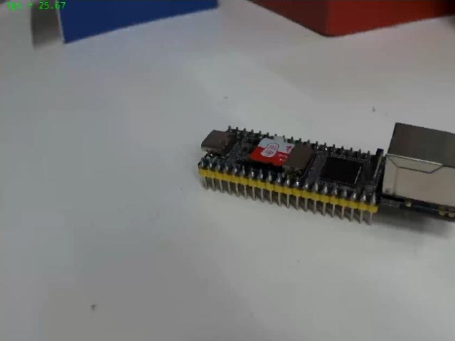
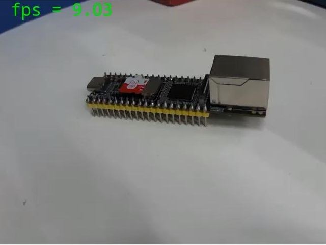
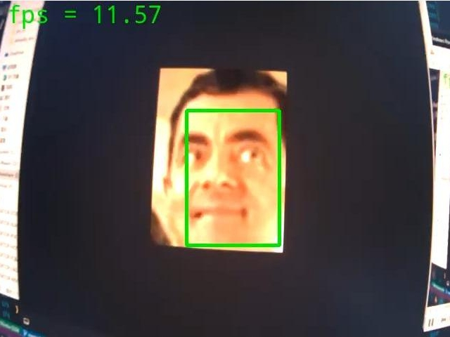
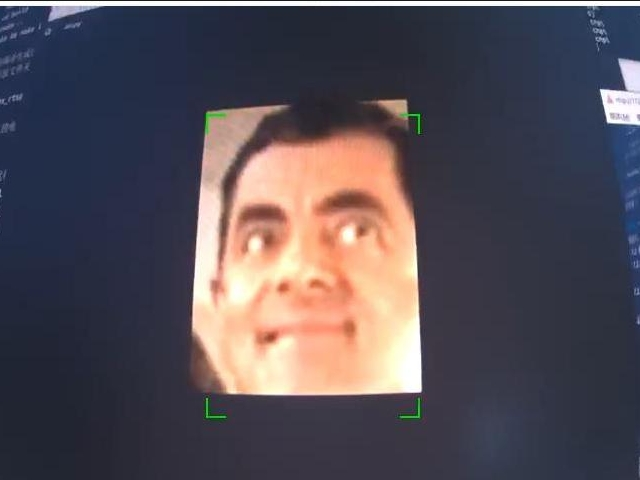
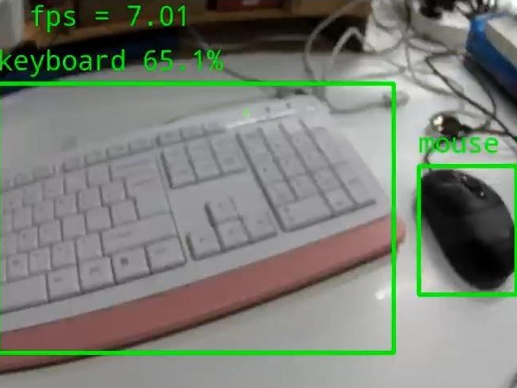

# Luckfox Pico RKMPI example
[中文](./README_CN.md)
+ This example is based on RKMPI and Opencv-Mobile for image encoding and streaming.
+ This example uses RKNN for image recognition inference.
+ Example code for video capture and streaming specifically developed for Luckfox Pico series development boards.

## Implementation Results
### luckfox_pico_rtsp_opencv   


### luckfox_pico_rtsp_opencv_capture


### luckfox_pico_rtsp_retinaface   


### luckfox_pico_rtsp_retinaface_osd 


### luckfox_pico_rtsp_yolov5        


## Platform Support
 DEMO                           | CPU | system | Camera |
------------------------------- | --- | ---- | ------- |
luckfox_pico_rtsp_opencv        | RV1103(resolution adjustment required),rv1106 | buildroot | sc3336
luckfox_pico_rtsp_opencv_capture| RV1103,RV1106 | buildroot | sc3336 
luckfox_pico_rtsp_retinaface    | RV1103,RV1106 | buildroot | sc3336 
luckfox_pico_rtsp_retinaface_osd| RV1103,RV1106 | buildroot | sc3336 
luckfox_pico_rtsp_yolov5        | RV1106        | buildroot | sc3336 

+ **RV1103**:`Luckfox Pico` `Luckfox Pico Mini A` `Luckfpx Pico Miini B` `Luckfox Pico Plus`
+ **RV1106**:`Luckfox Pico Pro` `Luckfox Pico Max` `Luckfox Pico Ultra` `Luckfox Pico Ultra W`

## Compilation
+ Set up environment variables
    ```
    export LUCKFOX_SDK_PATH=<luckfox-pico SDK path>
    ```
    **Note**: Use absolute path.
+ Obtain the repository source code and set the execution permissions for the automated build script
    ```
    chmod a+x ./build.sh
    ./build.sh
    ```
+ After executing `./build.sh`, select the example to compile
    ```
    1) luckfox_pico_rtsp_opencv
    2) luckfox_pico_rtsp_opencv_capture
    3) luckfox_pico_rtsp_retinaface
    4) luckfox_pico_rtsp_retinaface_osd
    5) luckfox_pico_rtsp_yolov5
    Enter your choice [1-5]:
    ```

## Running
+ After compilation, the corresponding deployment folder will be generated in the install directory
    ```
    luckfox_pico_rtsp_opencv_capture_demo  
    luckfox_pico_rtsp_retinaface_demo
    luckfox_pico_rtsp_yolov5_demo
    luckfox_pico_rtsp_opencv_demo          
    luckfox_pico_rtsp_retinaface_osd_demo
    ```
+ Upload the generated deployment folder to the Luckfox Pico (using adb, ssh, etc.). On the board, enter the folder and run the demo
    ```
    # On the Luckfox Pico board, <Demo Target> is the executable program within the deployment folder
    chmod a+x <Demo Target>
    ./<Demo Target>
    ```
    **Note:** Do not alter the structure of the deployment folder.
+ Use VLC to open the network stream `rtsp://172.32.0.93/live/0` (adjust the IP address as needed to retrieve the image)


## Note
+ Before running the demo, execute `RkLunch-stop.sh` to disable the default background app `rkicp` running on luckfox-pico, which occupies the camera.
+ Due to the limited system resources of the RV1103, please reduce the video capture resolution if it does not run properly.
+ Due to the update of the Rockit library, the VPSS component can no longer extract data frames independently. The image color format conversion will be replaced by OpenCV-mobile.

## Detail
[RKMPI Instance User Guide](https://wiki.luckfox.com/Luckfox-Pico/Luckfox-Pico-RV1106/Luckfox-Pico-Ultra-W/Luckfox-Pico-GPIO/RKMPI-example)