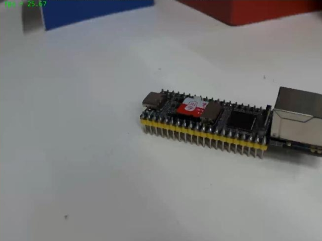
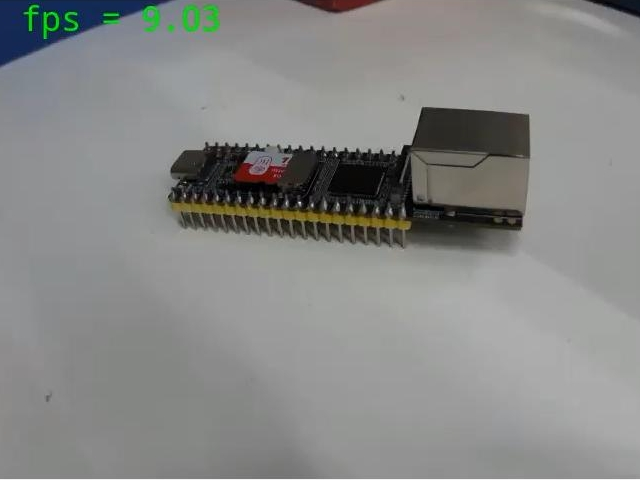
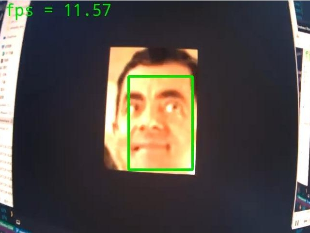

# Luckfox Pico RKMPI example
[English](./README.md)
+ 本例程基于 RKMPI 和 Opencv-Mobile 实现图像编码推流
+ 本例程基于 RKNN 实现图像识别推理
+ 专为 Luckfox Pico 系列开发板提供视频捕获推流的例程

## 实现效果
### luckfox_pico_rtsp_opencv   


### luckfox_pico_rtsp_opencv_capture


### luckfox_pico_rtsp_retinaface   


### luckfox_pico_rtsp_retinaface_osd 


### luckfox_pico_rtsp_yolov5        


## 平台支持
 DEMO                           | CPU | 系统 | 摄像头 |
------------------------------- | --- | ---- | ------- |
luckfox_pico_rtsp_opencv        | RV1103(需修改分辨率)、RV1106 | buildroot | sc3336
luckfox_pico_rtsp_opencv_capture| RV1103、RV1106 | buildroot | sc3336 
luckfox_pico_rtsp_retinaface    | RV1103、RV1106 | buildroot | sc3336 
luckfox_pico_rtsp_retinaface_osd| RV1103、RV1106 | buildroot | sc3336 
luckfox_pico_rtsp_yolov5        | RV1106         | buildroot | sc3336 

+ **RV1103**：`Luckfox Pico` `Luckfox Pico Mini A` `Luckfpx Pico Miini B` `Luckfox Pico Plus`
+ **RV1106**：`Luckfox Pico Pro` `Luckfox Pico Max` `Luckfox Pico Ultra` `Luckfox Pico Ultra W`

## 编译
+ 设置环境变量
    ```
    export LUCKFOX_SDK_PATH=< luckfox-pico Sdk 地址>
    ```
    **注意**：使用绝对地址。
+ 获取仓库源码并设置自动编译脚本执行权限
    ```
    chmod a+x ./build.sh
    ./build.sh
    ```
+ 执行 `./build.sh` 后选择编译的例程
    ```
    1) luckfox_pico_rtsp_opencv
    2) luckfox_pico_rtsp_opencv_capture
    3) luckfox_pico_rtsp_retinaface
    4) luckfox_pico_rtsp_retinaface_osd
    5) luckfox_pico_rtsp_yolov5
    Enter your choice [1-5]:
    ```

## 运行
+ 编译完成后会在 install 文件夹下生成对应的部署文件夹
    ```
    luckfox_pico_rtsp_opencv_demo  
    luckfox_pico_rtsp_opencv_capture_demo  
    luckfox_pico_rtsp_retinaface_demo
    luckfox_pico_rtsp_retinaface_osd_demo
    luckfox_pico_rtsp_yolov5_demo 
    ```
+ 将生成的部署文件夹完整上传到 Luckfox Pico 上 (可使用adb ssh等方式) ，板端进入文件夹运行
    ```
    # 在 Luckfox Pico 板端运行，<Demo Target> 是部署文件夹中的可执行程序
    chmod a+x <Demo Target>
    ./<Demo Target>
    ```
+ 使用 VLC 打开网络串流 `rtsp://172.32.0.93/live/0`（按实际情况修改 IP 地址拉取图像）

## 注意
+ 在运行demo前请执行 `RkLunch-stop.sh` 关闭 Luckofox Pico 开机默认开启的后台程序 `rkicp` ,解除对摄像头的占用。
+ RV1103 的系统资源较少，无法正常运行时请降低视频捕获的分辨率。
+ 由于 Rockit 库的更新，VPSS 组件无法继续单独取出数据帧，图像颜色格式的转换使用 Opencv-mobile 来替换。

## 详细
[RKMPI实例使用指南](https://wiki.luckfox.com/zh/Luckfox-Pico/Luckfox-Pico-RV1106/Luckfox-Pico-Ultra-W/RKMPI-example)